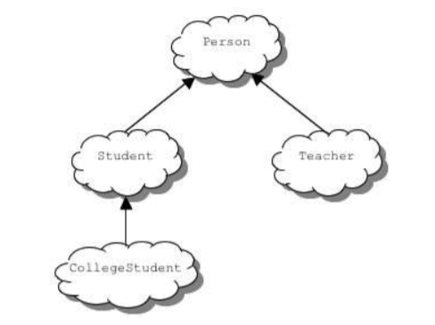

# 10.1-Back-To-School
## Background: 
The HighSchool application, as explained in the lesson, comprises two classes: the Person superclass and the Student subclass. In this lab, you will create four classes—Teacher, HighSchoolStudent, Freshman, and Senior—utilizing the concept of inheritance.

The Teacher class, resembling the Person class, will possess additional properties such as salary (indicating the teacher's earnings) and subject (e.g., "Computer Science," "Chemistry," "English," and "Other").

The HighSchoolStudent class extends the Student class by introducing two additional attributes: year (indicating the current level in high school) and academy (e.g., "Classical," "Global Studies"). Additionally, two new methods, of your choice, will be incorporated into the HighSchoolStudent class.

Both the Freshman and Senior classes will extend the HighSchoolStudent class. For each of these classes, there should be an override of one inherited method, and a unique method specific to each class should be created. This structure enhances the hierarchy by showcasing the specialization of the Freshman and Senior classes while maintaining the inheritance chain.


The inheritance hierarchy follows: 




Here is the Person base class from the lesson to be used as a starting point for the Teacher class: 
```java
public class Person{ 
	private String myName ; // name of the person 
	private int myAge; // person's age 
	private String myGender; // "M" for male, "F" for female 

// constructor 
	public Person(String name, int age, String gender){ 
		myName = name; 
		myAge = age; 
		myGender = gender; 
	} 

	public String getName(){ 	
		return myName; 
	} 

	public int getAge(){ 
		return myAge; 
	} 

	public String getGender(){ 
		return myGender; 
	} 

	public void setName(String name){ 
		myName = name; 
	} 

	public void setAge(int age){ 
		myAge = age; 
	} 

	public void setGender(String gender){ 
		myGender = gender; 
	} 

	public String toString(){ 
		return myName + ", age: " + myAge + ", gender: " + myGender; 
	} 
} 
```

The Student class is derived from the Person class and used as a starting point for the CollegeStudent class: 

```java
public class Student extends Person{ 
	private String myIdNum; // Student Id Number 
	private double myGPA; // grade point average 

	// constructor 
	public Student(String name, int age, String gender, String idNum, double gpa){ 
		// use the super class' constructor 
		super(name, age, gender); 
		// initialize what's new to Student 
		myIdNum = idNum; 
		myGPA = gpa; 
	} 

	public String getIdNum(){ 
		return myIdNum; 
	} 

	public double getGPA(){ 
		return myGPA; 
	} 

	public void setIdNum(String idNum){ 
		myIdNum = idNum; 
	} 

	public void setGPA(double gpa){ 
		myGPA = gpa; 
	} 

	// overrides the toString method in the parent class 
	public String toString(){ 
		return super.toString() + ", student id: " + myIdNum + ", gpa: " + myGPA; 
	} 
} 
```
## Assignment: 
1. You will be provided with two source files as shown above: Person.java for the Person class, Student.java for the Student class. These files should be used throughout this assignment. 
2. Write a Teacher class that extends the parent class Person. 
	- Add instance variables to the class for subject (e.g. “Computer Science”, "Chemistry", "English", "Other”) and salary (the teacher’s annual salary). Subject should be of type String and salary of type double. Choose appropriate names for the instance variables.
	- Write a constructor for the Teacher class. The constructor will use five parameters to initialize myName, myAge, myGender, subject, and salary. Use the super reference to use the constructor in the Person superclass to initialize the inherited values. 
	- Write “setter” and “getter” methods for all of the class variables. For the Teacher class they would be: getSubject, getSalary, setSubject, and setSalary. 
	- Write the toString() method for the Teacher class. Use a super reference to do the things already done by the superclass. 
3. Write a HighSchoolStudent subclass that extends the Student class. 
	- Add instance variables to the class for academy and year. Academy should be of type String and year of type int. Choose appropriate names for the instance variables. 
	- Write a constructor for the HighSchoolStudent class. The constructor will use seven parameters to initialize myName, myAge, myGender, myIdNum, myGPA, year, and major. Use the super reference to use the constructor in the Student superclass to initialize the inherited values. 
	- Write “setter” and “getter” methods for all of the class variables. For the CollegeStudent class they would be: getYear, getMajor, setYear, and setMajor. 
	- Write the toString() method for the HighSchoolStudent class. Use a super reference to do the things already done by the superclass. 
4. 

User
Create an assignment for students learning java which requires them to practice inheritance
ChatGPT
Assignment Title: Java Inheritance Practice

Objective:
The goal of this assignment is to reinforce your understanding of Java inheritance concepts. Through this assignment, you will have the opportunity to implement inheritance in Java classes and explore the benefits and usage of inheritance in a programming context.

Instructions:

1. Class Hierarchy:
Define a class hierarchy related to a real-world scenario or concept of your choice. For example, you can create a hierarchy for animals, shapes, vehicles, etc. Ensure that the hierarchy has at least three levels of inheritance.

2. Base Class:
Create a base class that includes common attributes and methods applicable to all classes in your hierarchy. This class should serve as the foundation for the entire hierarchy.

3. Derived Classes:
Implement at least two derived classes that inherit from the base class. Each derived class should introduce new attributes or methods specific to its type while inheriting and utilizing features from the base class.

4. Overriding Methods:
Override at least one method in each derived class. This will demonstrate the concept of polymorphism and the ability to provide specific implementations for methods in the derived classes.

5. Demonstration:
In the main program, create instances of the base class and derived classes. Demonstrate the use of inherited methods and attributes. Also, showcase the overridden methods and explain how they contribute to the polymorphic behavior.

6. Additional Features (Optional):
Introduce additional features to make your program more interesting. This could include implementing interfaces, using abstract classes, or incorporating exception handling.

Submission:
Submit your Java program along with a brief explanation of the class hierarchy, the purpose of each class, and how inheritance is utilized in your implementation.

Evaluation Criteria:

Correct implementation of the class hierarchy.
Proper use of inheritance to share and extend functionality.
Successful demonstration of polymorphic behavior through overridden methods.
Clarity and organization of code.
Additional features and creativity (if included).
Feel free to reach out if you have any questions or need clarification on the assignment. Happy coding!

User
Could you make a similar assignment where students model high school with the classes 
ChatGPT
Assignment Title: High School Modeling with Java Inheritance

Objective:
The objective of this assignment is to apply Java inheritance concepts to model a simplified representation of a high school structure. Through this exercise, you will gain hands-on experience in designing a class hierarchy that mirrors real-world scenarios within a high school environment.

Instructions:

1. Class Hierarchy:
Create a class hierarchy representing different entities within a high school. Consider including classes for students, teachers, and courses. Ensure that your hierarchy has at least three levels of inheritance.

2. Base Class:
Develop a base class that captures common attributes and methods applicable to all entities in your high school model. This base class should serve as the foundation for all classes in the hierarchy.

3. Derived Classes:
Implement at least two derived classes, such as Student and Teacher, that inherit from the base class. Introduce attributes and methods specific to each derived class while leveraging features inherited from the base class.

4. Overriding Methods:
Override at least one method in each derived class. For example, you might override a method related to attendance for students and grading for teachers. Demonstrate how overridden methods contribute to the polymorphic behavior.

5. Relationships and Interactions:
Model relationships and interactions between classes. For instance, a student may be enrolled in multiple courses, and a teacher may be assigned to teach specific courses. Show how these relationships are represented in your Java program.

6. Demonstration:
In the main program, create instances of the base class and derived classes. Demonstrate the use of inherited methods and attributes. Illustrate interactions between different entities in your high school model.

7. Additional Features (Optional):
Introduce additional features to enhance your program. This could include using interfaces to represent extracurricular activities, incorporating abstract classes for specialized roles, or implementing exception handling.

Submission:
Submit your Java program along with a brief explanation of the high school class hierarchy, the purpose of each class, and how inheritance is utilized in your implementation.

Evaluation Criteria:

Correct implementation of the high school class hierarchy.
Proper use of inheritance to share and extend functionality.
Successful demonstration of polymorphic behavior through overridden methods.
Representation of relationships and interactions between classes.
Clarity and organization of code.
Additional features and creativity (if included).
Feel free to ask if you have any questions or need further guidance. Happy coding!

User
Can you add more complexity
ChatGPT
Assignment Title: Advanced High School Modeling with Java Inheritance

Objective:
This assignment aims to challenge your understanding of Java inheritance by introducing additional complexity to the high school modeling scenario. You will extend your previous high school model to include more features and demonstrate a deeper understanding of inheritance concepts.

Instructions:

1. Advanced Class Hierarchy:
Extend your class hierarchy to include more specialized classes. For example, you can introduce classes for sports teams, clubs, or administrative staff. Ensure that your hierarchy maintains a logical and cohesive structure.

2. Abstract Classes and Interfaces:
Utilize abstract classes to represent abstract concepts within your high school model. Additionally, implement interfaces to capture specific behaviors that may be shared across different entities. Show how these features contribute to the overall design.

3. Composition:
Introduce a composition relationship between classes. For instance, a student may have a composition relationship with a list of courses they are currently enrolled in. Demonstrate how composition enhances the representation of complex relationships within your model.

4. Exception Handling:
Implement exception handling to handle potential errors or exceptional situations in your program. This could include scenarios such as invalid input, missing data, or other exceptional cases related to high school entities.

5. File I/O:
Extend your program to read and write data to files. For example, you can store information about students, teachers, and courses in external files. Implement file I/O functionality to load and save data from/to these files.

6. Additional Features (Optional):
Introduce additional features to make your program more sophisticated. This could include implementing a scheduling system, handling events or activities, or incorporating a grading system with different criteria.

Submission:
Submit your Java program along with a detailed explanation of the extended high school class hierarchy, the purpose of each class, and how advanced inheritance concepts are applied in your implementation. Provide sample input and output to showcase the functionality of your program.

Evaluation Criteria:

Well-structured and extended high school class hierarchy.
Effective use of abstract classes, interfaces, and composition.
Implementation of exception handling to enhance program robustness.
Successful integration of file I/O functionality.
Clarity and organization of code.
Additional features and creativity in addressing the assignment's complexity.
Feel free to reach out if you have any questions or need further assistance. Good luck with the advanced high school modeling assignment!

User
Thank you.
ChatGPT
You're welcome! If you have any more questions or if there's anything else I can help you with, feel free to ask. Happy coding, and good luck with your assignment!

User
Edit for clarity and grammar: The HighSchool application described in the lesson has two classes: the Person superclass and the Student subclass. In this lab you will create four classes, Teacher, HighSchoolStudent, Freshman and Senior, using inheritance. A Teacher will be like Person but will have additional properties such as salary (the amount the teacher earns) and subject (e.g. "Computer Science", "Chemistry", "English", and "Other"). The HighSchoolStudent class will extend the Student class by adding a year (current level in high school) and academy (e.g. "Classical", "Global Studies",) as well as adding two additional methods. The Freshmen and Senior classes will extend the HighSchoolStudent class. Both the Freshman and Senior classes should override one of the inherited methods and create a method unique to it.
ChatGPT
The HighSchool application, as explained in the lesson, comprises two classes: the Person superclass and the Student subclass. In this lab, you will create four classes—Teacher, HighSchoolStudent, Freshman, and Senior—utilizing the concept of inheritance.

The Teacher class, resembling the Person class, will possess additional properties such as salary (indicating the teacher's earnings) and subject (e.g., "Computer Science," "Chemistry," "English," and "Other").

The HighSchoolStudent class extends the Student class by introducing two additional attributes: year (indicating the current level in high school) and academy (e.g., "Classical," "Global Studies"). Additionally, two new methods will be added to the HighSchoolStudent class.

Both the Freshman and Senior classes will extend the HighSchoolStudent class. For each of these classes, there should be an override of one inherited method, and a unique method specific to each class should be created. This structure enhances the hierarchy by showcasing the specialization of the Freshman and Senior classes while maintaining the inheritance chain.

Ensure clarity in the implementation of properties, methods, and their respective functionalities in each class. This exercise will provide practical experience in designing a class hierarchy with inheritance in the context of a high school scenario.

User
edit for grammar and clarity: Additionally, two new methods will be added to the HighSchoolStudent class(your choice)
ChatGPT
Moreover, two new methods, of your choice, will be incorporated into the HighSchoolStudent class.

User
Write instructions for a Freshman and Senior class which align with the following instructions: 1. You will be provided with two source files as shown above: Person.java for the Person class, Student.java for the Student class. These files should be used throughout this assignment. 
2. Write a Teacher class that extends the parent class Person. 
	- Add instance variables to the class for subject (e.g. “Computer Science”, "Chemistry", "English", "Other”) and salary (the teacher’s annual salary). Subject should be of type String and salary of type double. Choose appropriate names for the instance variables.
	- Write a constructor for the Teacher class. The constructor will use five parameters to initialize myName, myAge, myGender, subject, and salary. Use the super reference to use the constructor in the Person superclass to initialize the inherited values. 
	- Write “setter” and “getter” methods for all of the class variables. For the Teacher class they would be: getSubject, getSalary, setSubject, and setSalary. 
	- Write the toString() method for the Teacher class. Use a super reference to do the things already done by the superclass. 
3. Write a HighSchoolStudent subclass that extends the Student class. 
	- Add instance variables to the class for academy and year. Academy should be of type String and year of type int. Choose appropriate names for the instance variables. 
	- Write a constructor for the HighSchoolStudent class. The constructor will use seven parameters to initialize myName, myAge, myGender, myIdNum, myGPA, year, and major. Use the super reference to use the constructor in the Student superclass to initialize the inherited values. 
	- Write “setter” and “getter” methods for all of the class variables. For the CollegeStudent class they would be: getYear, getMajor, setYear, and setMajor. 
	- Write the toString() method for the HighSchoolStudent class. Use a super reference to do the things already done by the superclass. 
4. Write a Freshman subclass that extends the HighSchoolStudent class. 
    - Begin by extending the HighSchoolStudent class, inheriting properties and methods.
    - Introduce a new instance variable, unique to the Freshman class, representing a specific characteristic relevant to freshmen. Choose an appropriate name for this variable.
    - Write a constructor for the Freshman class. Utilize the super reference with the necessary parameters to initialize inherited values and the newly introduced variable.
    - Implement "setter" and "getter" methods for the new instance variable.
    - Override one of the inherited methods from the HighSchoolStudent class, providing a distinct implementation.
    - Create a unique method specific to the Freshman class, showcasing the distinctive attributes or behaviors associated with freshmen.
5. Write a Freshman subclass that extends the HighSchoolStudent class.
    - Extend the HighSchoolStudent class to inherit its properties and methods.
    - Introduce a new instance variable, exclusive to the Senior class, representing a characteristic pertinent to seniors. Choose an appropriate name for this variable.
    - Write a constructor for the Senior class. Use the super reference along with the necessary parameters to initialize inherited values and the newly introduced variable.
    - Implement "setter" and "getter" methods for the new instance variable.
    - Override one of the inherited methods from the HighSchoolStudent class, providing a distinct implementation.
    - Create a unique method specific to the Senior class, illustrating the distinctive attributes or behaviors associated with seniors.
6. Write a testing class with a main() that constructs all of the classes and calls their toString() method. Sample usage would be: 

  